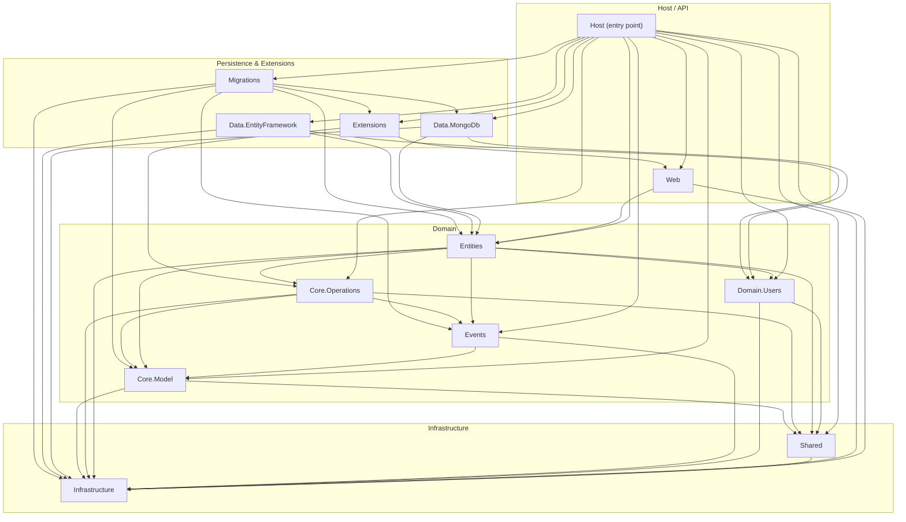

# Squidex Architecture

This document maps the conceptual layers of the Squidex headless CMS to their
real file paths in this repository. It is kept intentionally minimal — covering
the request lifecycle, the write path (commands), and the read path (queries).

---

## Layer map

| Layer | Concept | Real path |
|---|---|---|
| Entry point | ASP.NET host | `backend/src/Squidex/Program.cs` |
| Web host config | DI wiring & middleware | `backend/src/Squidex/Startup.cs` |
| REST API surface | Controllers per domain | `backend/src/Squidex/Areas/Api/Controllers/` |
| App API | App-level endpoints | `backend/src/Squidex/Areas/Api/Controllers/Apps/` |
| Contents API | Content CRUD endpoints | `backend/src/Squidex/Areas/Api/Controllers/Contents/` |
| Domain entities | App/Schema/Content logic | `backend/src/Squidex.Domain.Apps.Entities/` |
| App domain object | App aggregate root | `backend/src/Squidex.Domain.Apps.Entities/Apps/DomainObject/AppDomainObject.cs` |
| App provider | App read-model lookup | `backend/src/Squidex.Domain.Apps.Entities/AppProvider.cs` |
| Domain model | Pure value types & rules | `backend/src/Squidex.Domain.Apps.Core.Model/` |
| Languages model | Language config type | `backend/src/Squidex.Domain.Apps.Core.Model/Apps/LanguagesConfig.cs` |
| Domain operations | Cross-cutting logic | `backend/src/Squidex.Domain.Apps.Core.Operations/` |
| Domain events | Immutable event types | `backend/src/Squidex.Domain.Apps.Events/` |
| Infrastructure | Event sourcing, caching | `backend/src/Squidex.Infrastructure/` |
| Event store | Event sourcing core | `backend/src/Squidex.Infrastructure/EventSourcing/` |
| Aggregate states | In-memory state store | `backend/src/Squidex.Infrastructure/States/` |
| Commands bus | Mediator for writes | `backend/src/Squidex.Infrastructure/Commands/` |
| MongoDB adapter | Persistence (default) | `backend/src/Squidex.Data.MongoDb/` |
| EF Core adapter | Persistence (alternative) | `backend/src/Squidex.Data.EntityFramework/` |

---

## Component diagram

<!-- DIAGRAM-AUTO:START generated by scripts/generate-architecture.sh — do not edit by hand -->

<!-- DIAGRAM-AUTO:END -->

---

## Data flows

### 1. Write path — Add a language to an app

```
HTTP POST /api/apps/{app}/languages
  │
  └─► AppsController  (backend/src/Squidex/Areas/Api/Controllers/Apps/)
        │  deserialise body → AddLanguage command
        └─► CommandBus.PublishAsync()  (backend/src/Squidex.Infrastructure/Commands/)
              │  route by aggregate id
              └─► AppDomainObject.ExecuteAsync()
                    │  (backend/src/Squidex.Domain.Apps.Entities/Apps/DomainObject/AppDomainObject.cs)
                    │  validate via LanguagesConfig  (backend/src/Squidex.Domain.Apps.Core.Model/Apps/LanguagesConfig.cs)
                    └─► raise AppLanguageAdded event  (backend/src/Squidex.Domain.Apps.Events/)
                          │
                          └─► EventStore.AppendAsync()
                                (MongoDb: backend/src/Squidex.Data.MongoDb/
                                 or EF:   backend/src/Squidex.Data.EntityFramework/)
```

### 2. Read path — Get app languages

```
HTTP GET /api/apps/{app}/languages
  │
  └─► LanguagesController  (backend/src/Squidex/Areas/Api/Controllers/Languages/)
        │
        └─► AppProvider.GetAppAsync()  (backend/src/Squidex.Domain.Apps.Entities/AppProvider.cs)
              │  hit in-memory / distributed cache first
              └─► States store  (backend/src/Squidex.Infrastructure/States/)
                    │  rehydrate from event log if needed
                    └─► EventStore  (MongoDb or EF adapter)
```

### 3. Bootstrap / startup dependency flow

```
Program.cs  →  CreateHostBuilder()
  │
  └─► Host.ConfigureServices()
        │
        ├─► Squidex.Infrastructure  (event bus, commands, caching)
        ├─► Squidex.Domain.Apps.Entities  (app/schema/content services)
        ├─► Squidex.Data.MongoDb  OR  Squidex.Data.EntityFramework  (persistence)
        └─► Squidex.Web  (middleware, auth, OpenAPI)
```

---

## Testing entry points

| Suite | Path | What it covers |
|---|---|---|
| Core model unit tests | `backend/tests/Squidex.Domain.Apps.Core.Tests/` | Pure domain model (LanguagesConfig etc.) |
| Domain entities unit tests | `backend/tests/Squidex.Domain.Apps.Entities.Tests/` | AppDomainObject command handling |
| Infrastructure tests | `backend/tests/Squidex.Infrastructure.Tests/` | Event sourcing, caching, commands |
| E2E / Playwright | `tools/e2e/` | Full browser-based acceptance tests |
